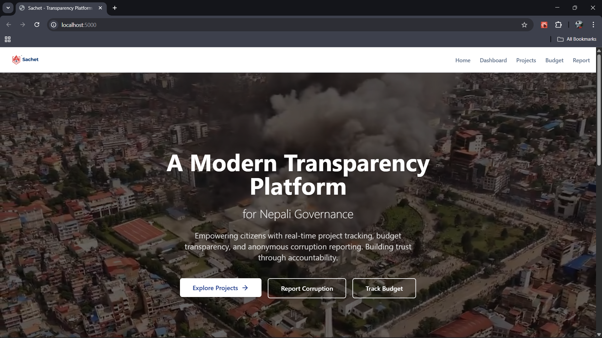
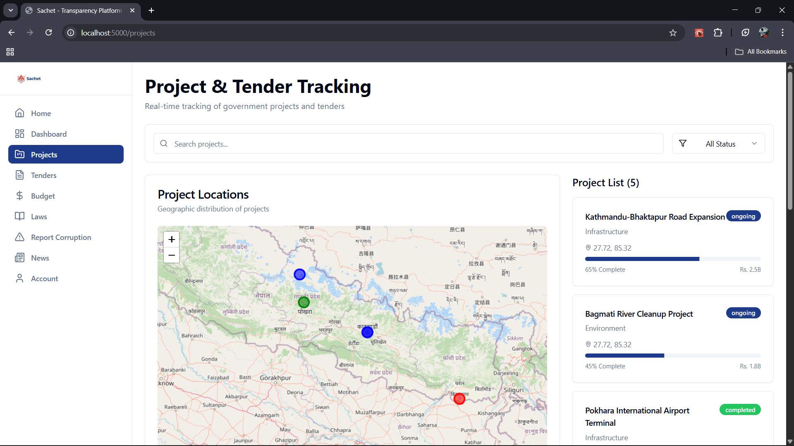
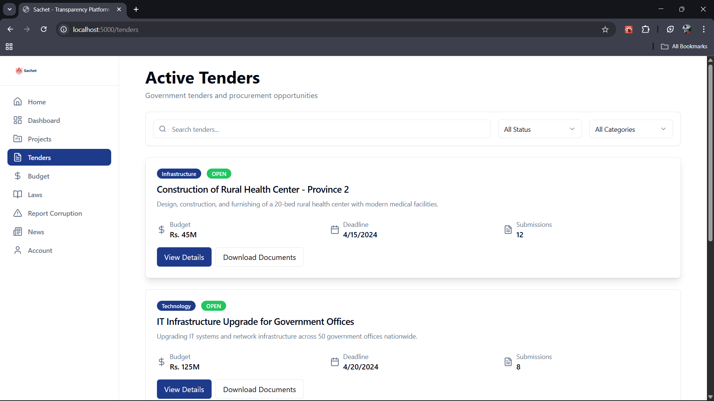

# Sachet - Transparency Platform for Nepali Governance

A modern, citizen-focused prototype designed to bridge the trust gap between the government and the people of Nepal.

## Purpose
**Sachet** has one goal: to make governance transparent and accessible. In the aftermath of the GenZ protests, the call for accountability in Nepal is stronger than ever. This platform empowers citizens by:
- **Tracking Budgets**: Real-time visualization of how public funds are spent.
- **Monitoring Projects**: Updates on the status of infrastructure and local development.
- **Simplified Laws**: Breaking down complex legal documents into easy-to-read summaries.
- **Anonymous Reporting**: A secure, encrypted way for citizens to report corruption without fear of retaliation.

## Tech Stack
- **Frontend**: React (Vite)
- **Styling**: Tailwind CSS
- **Interactivity**: Lucide React (Icons), Radix UI (Components)
- **Data & Maps**: Leaflet.js (Geospatial tracking), Chart.js (Budget analytics)
- **Animations**: CSS3 Keyframes & Transitions

## Why This Matters for Nepal
Nepal is at a turning point. Following the impactful GenZ-led protests, there is a clear demand for a "Transparent Government" (Sunischit Shasan). Citizens are no longer satisfied with unclear processes. **Sachet** acts as a digital watchdog, making sure that transparency is not just a promise, but a real practice. By giving every Nepali citizen the tools to oversee public spending and project implementation, we move closer to the country we all want.
---

## 📸 visual Prototype

